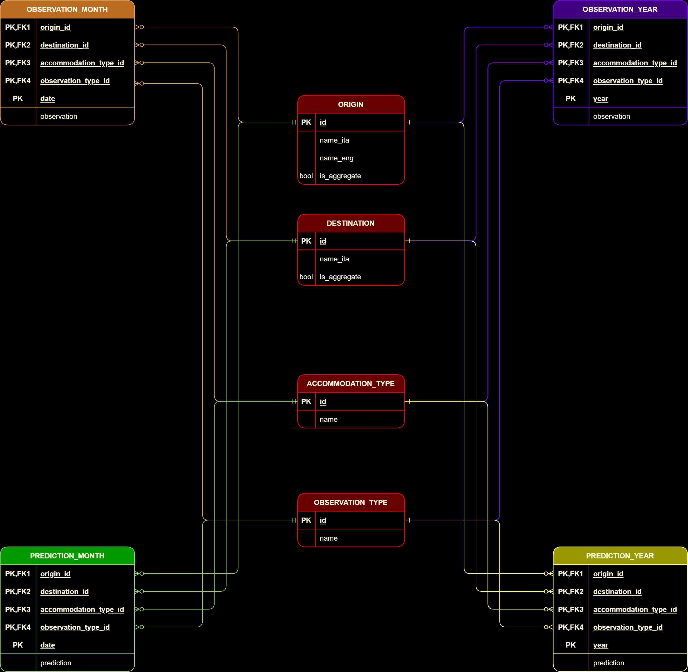

# Backend

This is the root folder for the project's Back-End.

# Project Architecture

# Database Schema

# Contents

## [<em>architecture.png</em>](./architecture.png)

Project's architecture overview

## [<em>DBusers</em>](./DBusers.md)

List of DB users after importing [DB dump](./stateadb_dump.sql)

## [<em>schema.png</em>](./schema.png)

DB schema diagram

## [<em>stateadb_dump.sql</em>](./stateadb_dump.sql)

DB data and schema dump

## [<em>Setup</em>](./Setup/readme.md)

It contains all the files necessary for the initial setup of the Back-End

## [<em>SpringServices</em>](./SpringServices/readme.md)

It contains the source code for the main services of the Back-End